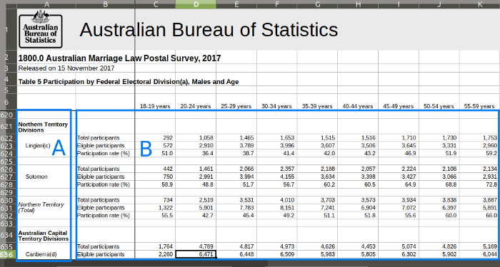

```{r setup, include=FALSE}
knitr::opts_chunk$set(echo = TRUE)
```

### Overview

At one point or another, we have all had to extract data out of a messy spreadsheet. We face a fork in the road when we decide how to handle this - do we adjust the spreadsheet to make it easy for us to read in or do we write more complicated code to ingest? The first option usually makes our lives easier in the short run, that we change some column names, unmerge some headers, and so on in the spreadsheet. The problem comes later on when you are given a new version of the file and have to replicate all your manual adjustments from memory in the exact same way. Or something comes up that calls into question the data - was it in the original or did it get messed up when you adjusted the file.

The more challenging option from the start is to figure out the load via coding it, but the benefit is that everything is documented and if you have to re-run with a new file, everything is good to go.

So, let's talk through how to do this using R, which has some great packages to make your life a bit easier with this difficult task.

For today's session, we're going to go a similar walk through from a great [blog post Miles McBain wrote](https://medium.com/@miles.mcbain/tidying-the-australian-same-sex-marriage-postal-survey-data-with-r-5d35cea07962) back in 2017. The dataset is the same and we end with a similar result, but the process is slightly different (probably in large part due to the updates to these packages in the past 4 years).

### Getting Started
To start, let's download the messy spreadsheet that McBain covers from the Australian Bureau of Statistics. We want to grab the [Australian Marriage Law Postal Survey 2017 - Participation spreadsheet](https://www.abs.gov.au/AUSSTATS/abs@.nsf/DetailsPage/1800.02017?OpenDocument). The data here is on the 2017 same sex marriage referendum in Australia.

Before importing a new dataset for the first time, its best to open it up and understand what you're working with. What issues do you see with the spreadsheet?

McBain writes:

> We have the electorate-level participation data for males and females inexplicably split across two gendered sheets. I preferred to start with just one sheet and work out a way to abstract my approach to both sheets later. For the first sheet I broke the problem down into two parts:



>Dealing with A) and B) separately hinges on being able to read in separate data frames from areas within a sheet of an .xlsx file. Luckily the readxl package confers this ability. I split the problem because the merged cells worried me, and I thought it might lead to simpler code. See how for B) I only really need to worry about dropping rows that are all NA. I’ll also gather the data into long format so that age range is one covariate. While for A) I have to filter out the subheadings and remove the footnotes embedded in the electorate name. 

As I mention, I'm going to go through a slightly different process and keep this all into one piece, taking advantage of `mutate()` and `fill()`.

### Data Time

Let's load up the packages we'll need to tackle this project.

```{r, echo = TRUE, message=FALSE}
library(tidyverse)
library(readxl)
library(janitor)
library(here)
```

Let's try reading in the spreadsheet. We care about table 5 and 6, which share a similar structure. We'll figure this out with table 5 and replicate with table 6.

```{r, message=FALSE}

file_name <- "australian_marriage_law_postal_survey_2017_-_participation_final.xls"

  read_excel(
      path = here("2021-03-15",file_name),
      sheet = "Table 5") %>% 
    glimpse()
  
  
```

We need to skip quite a few rows, 5 to be exact, since our table header start on row 6.

```{r, message=FALSE}
df <- read_excel(
      path = here("2021-03-15",file_name),
      sheet = "Table 5",
      skip = 5)

df
```

Let's add header to the missing columns and drop the total column. McBain adds the sex manually, but we're going to extra it from the last column name in each table and use that. So we'll extra the sex and then get rid of that column since its just a total.

```{r}

tail(names(df), 1)

mf <- df %>% 
  names() %>% 
  tail(1) %>%
  str_extract("(?<=Total ).*(?=\\()")
  
df <- df %>% 
  rename(area = ...1,
         indicator = ...2) %>% 
  mutate(sex = mf) %>% 
  select(-contains("Total")) %>% 
  glimpse()
```

Time to handle the areas. Merged cells from Excel are not machine readable so the the data are unmerged in R and stored in only the first cell. 

```{r}
df %>% 
  select(area)
```

We can solve this by using `tidyr::fill()`, which by default will fill down missing values.


```{r}
df <- df %>% 
  fill(area)

df %>% 
  select(area)
```

We can use a similar approach for the division, which are stored in Excel in the same row as the area. We want to capture those looking for any cells with division, creating a new column and then filling down.

```{r}
df <- df %>% 
  mutate(division = case_when(str_detect(area, "Divisions") ~ 
                                str_extract(area, "^.*(?= Divisions)"))) %>% 
  fill(division) %>% 
  relocate(division, .before = 1) %>% 
  glimpse()
```

There are a lot of extra rows - totals, footnotes and just blank rows for table spacing. Let's remove the excess.

```{r}
df <- df %>% 
  filter(!is.na(indicator),
         str_detect(area, "Total", negate = TRUE))
```

Almost there. The last thing we need to do is make this a tidy dataset. Ages should be a column rather than each age group being its own column. And then we want the indicators to each be their own column.

```{r, warning=FALSE}
df <- df %>% 
  pivot_longer(-c(division, area, indicator, sex),
               names_to = c("age_group", NA),
               names_sep = " ") %>% 
  mutate(age_group = if_else(age_group == "85", "85+", age_group))

df <- df %>% 
  pivot_wider(names_from = indicator,
              values_from = value) %>% 
  clean_names() %>% 
  mutate(participation_rate_percent = participation_rate_percent/100)

df
```

So we were able to get that to work with the male table. We can create a function from the work we did above so that we can run the same code over the two tabs.

```{r}
extract_data <- function(file, tab){
  
  df <- read_excel(
      path = here("2021-03-15",file_name),
      sheet = tab,
      skip = 5)
    
  mf <- df %>% 
    names() %>% 
    tail(1) %>%
    str_extract("(?<=Total ).*(?=\\()")
    
  df <- df %>% 
    rename(area = ...1,
           indicator = ...2) %>% 
    mutate(sex = mf) %>% 
    select(-contains("Total"))
  
  df <- df %>% 
    fill(area) %>% 
    mutate(division = case_when(str_detect(area, "Divisions") ~ 
                                  str_extract(area, "^.*(?= Divisions)"))) %>% 
    fill(division) %>% 
    relocate(division, .before = 1) %>% 
    filter(!is.na(indicator),
           str_detect(area, "Total", negate = TRUE))
  
  df <- df %>% 
    pivot_longer(-c(division, area, indicator, sex),
                 names_to = c("age_group", NA),
                 names_sep = " ") %>% 
    mutate(age_group = if_else(age_group == "85", "85+", age_group)) %>% 
    pivot_wider(names_from = indicator,
                values_from = value) %>% 
    clean_names() %>% 
    mutate(participation_rate_percent = participation_rate_percent/100)
  
  return(df)

}
```

Et voila!

```{r, message=FALSE,warning=FALSE}

df_all <- map_dfr(c("Table 5", "Table 6"),
                ~extract_data(file_name, .x))
df_all
```

