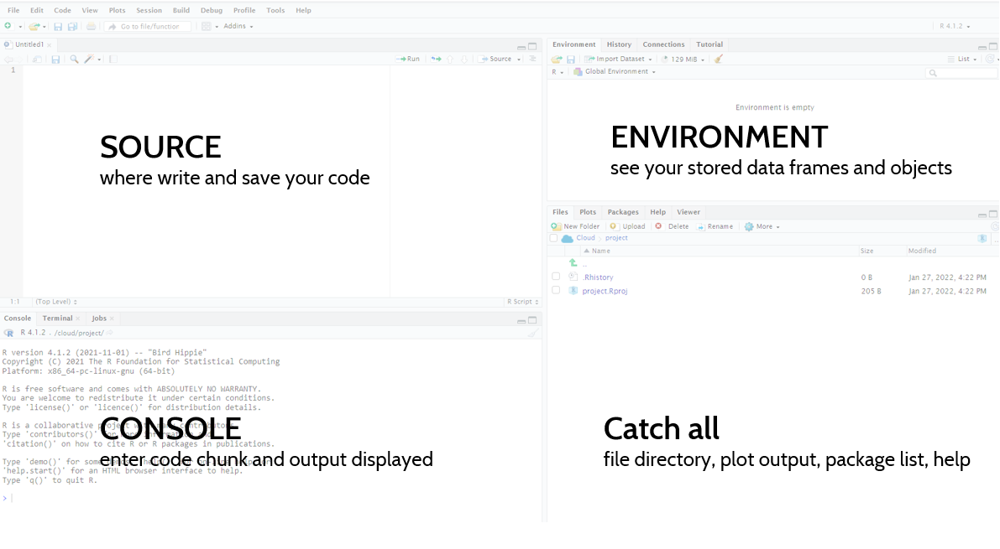

```{r setup, include=FALSE}
knitr::opts_chunk$set(echo = TRUE,
                      warning=F,
                      fig.height = 3, fig.width = 6,
                      fig.retina = 2)
```
## RBBS 2 - Visualization, Part I
For our R Building Blocks session today, we will be kicking everything off and giving a quick run down of R and getting a sense of how plotting with in R with the `ggplot` package. This session is modeled after [Chapter 3 of R for Data Science](https://r4ds.had.co.nz/data-visualisation.html).

### Learning Objectives
  - Part I
    - Become familiar with the RStudio IDE
    - Understand the basic framework to build a plot
    - Know what aesthetics are
    - Understand the difference between adding aesthetics within and outside of `aes()`
    - Able to create small multiples

### Recording
You can use [this link](https://drive.google.com/file/d/1i_zg4QpgtcxvK-w1QttSZzFHxp-pvuNA/view?usp=sharing) to access today's recording.

### Setup
For these sessions, we'll be using RStudio which is an IDE, "Integrated development environment" that makes it easier to work with R. For help on getting setup and installing packages, please reference [this guide](https://usaid-oha-si.github.io/corps/rbbs/2022/01/28/rbbs-0-setup.html).

### Exploring RStudio IDE
RStudio may seem imposing at first, but in no time you'll know where everything is. Your RStudio will be broken down into 4 main components.



  - Source: this box won't be here when you first open RStudio. If you go to File > New File > R Script, you will see this box. This is where you can write/save or open your R scripts. 
  - Console: below Source, you will have your console. This is where all your R code is excuted and where the outputs are displayed. If you want to run a line as a one off, you can write it here. There is an tab here called Terminal, which is where you can run code through the command line, git for example. 
  - Environment - moving to the upper right hand corner, you have your environment tab. This box contains all the datasets or objects you have stored in your current working session. 
  - Catch All - this last box has a lot of different features. You can see a number of tabs, which allow you to expore your directories/files, this is where your graphs will print, and where the help files are located.


### Loading packages 
Proprietary programs like Excel, Tableau, or Stata, build in and maintain all of the  functions into the software. With open-source packages, on the other hand, we need to load different libraries or packages that are written by other organization or individual users. This structure allows different users to provide specific "solutions" to a problem. For example, one the packages we'll use today is called `ggplot2`, which is all about visualization. A a packge is a collection of functions. If we wanted to run a time series regression or do text analysis, we would need to install and load different packages created by other users. There are lots and lots of packages out there and we will keep largely to those that are in the ["tidyverse"](https://www.tidyverse.org/), a set of packages "share an underlying design philosophy, grammar, and data structures" maintained mostly by "super developers" at RStudio. The other set of packages we'll use and promote are those [we have build in OHA](https://usaid-oha-si.github.io/tools/) and solve issues we routinely face with workflow and data. 

With a sense of the IDE and what packages are, we're ready to start working. Open up a new script if you don't have one open (File > New File > R Script or CTRL + SHIFT + N). In there, you will want to add the following code to load the libraries that we're going to use for this session (see [this guide](https://usaid-oha-si.github.io/corps/rbbs/2022/01/28/rbbs-0-setup.html) for help on installing packages), noting that packages have to be installed in order to be loaded. To run code from the console, you will hit CTRL + ENTER. This will run the current line your cursor is on. To run multiple lines, you will highlight those lines and then hit CTRL + ENTER. You can also run the entire script by clicking the “Source” button on the top right corner, or run highlighted lines by clicking “Run.” 


```{r}
library(tidyverse) #install.packages("tidyverse")
```
```{r, message=F}
library(scales) #install.packages("scales")
library(glitr) #remotes::install_github("USAID-OHA-SI/glitr", build_vignettes = TRUE)
```

### Viewing the data
The dataset we're using today is stored in the `glitr` package. It's a masked HFR dataset that has information for FY50 on multi-month dispensing, MMD. Let's take a look at the data using `glimpse()` and then `View()`. *If you are getting an error, make sure you reinstall `glitr` using the code in the section about*

```{r, eval=FALSE}
#see what datasets exist in the glitr package
data(package = "glitr")
```

```{r}
#load the dataset in your Global Environment
data(hfr_mmd)
```

```{r}
#prints out a preview of yoru data; indicators run vertically (with type) and data runs horizontally
glimpse(hfr_mmd)
```
```{r, eval = FALSE}
#your traditional tabular view
View(hfr_mmd)
```

Each row is a distinct reporting period (contained in the variables `date`, `fiscal_year`, and `hfr_pd`) with information on where the data were reported (contained in the variables `operatingunit` through `psnu`, which we can write `operatingunit:pnsu`), by whom (`mech_code`) and the values measured for number/share of individuals on treatment and multi-month dispensing (MMD) (`tx_curr:share_tx_mmd.o3mo`). For more information on the dataset, we can use the `?` to see the documentation through a "help" file. The `?` is extremely useful for getting help files across all functions. 

```{r, eval = FALSE}
#get help with ?[function] or place your cursor on the function and hit F1
?hfr_mmd
```
### Plotting
Great, we have our data, now we can move onto start plotting. To plot our data, we're going to a package called `ggplot2` which is part of the Tidyverse and installed/loaded with `tidyverse`.

Creating a plot with `ggplot2` is simply about providing some basic information and building layers as you go. We always will start with `ggplot()` to create a coordinate system and then add on a number of mapping arguments or layers. For `ggplot2` we can stack those layers by using the `+` sign at the end of each line.  So we are going to pass the dataset into `ggplot()` to start.  In addition to passing in the dataset, we need to provide the function with what we want on the x and y axis. We will start by creating a scatter plot using `geom_point()`. **We will want to start working with the code in our Script in the IDE, as opposed to the Console, to make it easier to run lines, make small tweaks, and rerun again.**

```{r}
ggplot(data = hfr_mmd) +
  geom_point(mapping = aes(x = date, y = share_tx_mmd.o3mo))
```

Et voila, we have a plot! Each of those points is a site in a given month associated with the value provided.

#### Exercises
  1.  How many rows are in `hfr_mmd`?
  1.  Create a plot to explore the relationship between patient volume (`tx_curr`) and share on over 3 months of treatment dispensing (`share_tx_mmd.3mo`). Looking at the help file and the plot, what makes this plot not very useful to drawing insights from?

### Aesthetic mapping
We have developed a basic plot with two lines of code. It's not very telling, but we can start to add layers of complexity through aesthetics. Wickham and Grolemond describe aesthetics as "An aesthetic is a visual property of the objects in your plot. Aesthetics include things like the size, the shape, or the color of your points" in addition to your data location (x and y coordinates).

One helpful aesthetic to apply to this plot is color. We can try adding our `y` value as the `color` as well and see what happens.

```{r}
ggplot(data = hfr_mmd) +
  geom_point(mapping = aes(x = date, y = share_tx_mmd.o3mo, 
                           color = share_tx_mmd.o3mo))
```

From this we can see that `ggplot` created a continuous scale ranging from dark blue on the lower end of `share_tx_mmd.o3mo` to ligher blue on the upper. We could also pass in a discrete scale, like `psnu`, which will assign color each PSNU a distinct color.

```{r}
ggplot(data = hfr_mmd) +
  geom_point(mapping = aes(x = date, y = share_tx_mmd.o3mo, color = psnu))
```

In addition to color, we can also pass in values to size our shapes.

```{r}
ggplot(data = hfr_mmd) +
  geom_point(mapping = aes(x = date, y = share_tx_mmd.o3mo, 
                           color = share_tx_mmd.o3mo, size = tx_curr))
```

Now that the points are different sizes, a number of them have been hidden because they are overlapped. We can adjust their transparency, called `alpha`, where 1 is completely opaque and 0 is completely transparent.

```{r}
ggplot(data = hfr_mmd) +
  geom_point(mapping = aes(x = date, y = share_tx_mmd.o3mo, 
                           color = share_tx_mmd.o3mo, size = tx_curr),
             alpha = .4)
```

Let's take a second to review the code we just ran and the plot output. What is interesting about the `alpha` aesthetic? In this example `alpha` sits outside our `aes()` mapping as a layer argument. By applying an aesthetic outside of `aes()`, we are manually applying the same aesthetic to all the data values in that geom as compared with `size`, in the example, which is scaling each point based on it's value for `tx_curr`.

One last feature to flag is that we can also pass in logic into the aesthetics. Maybe we want to highlight the data points below 60%.

```{r}
ggplot(data = hfr_mmd) +
  geom_point(mapping = aes(x = date, y = share_tx_mmd.o3mo,
                           color = share_tx_mmd.o3mo >= .6),
             alpha = .4)
```

In the plot above, we used boolean logic for the `color`, so TRUE and FALSE created different colors. 

#### Exercises
  1. What is wrong with the code below? Why are the points not green?
    ```
    ggplot(data = hfr_mmd) + geom_point(mapping = aes(x = date, y = share_tx_mmd.o3mo, color = "green"))
    ```
  1. Using a similar plot from the first exercise, change all the data points to size 6. Repeat this and change all the colors to of the points to purple.
  1. Use the `shape` aesthetic to change the shape based on `snu1`.
  

### Faceting
In addition to breaking out characteristics of the data with aesthetic mapping, we can also separate the main plot in small multiples, or facets. In one of the examples above, we applied a different color to each district (`psnu`) to differentiate the values. Rather than having all of these values on the same plot, we can break it into small multiples using `facet_wrap()`. 

Wickham and Grolemund describe the structure of `facet_wrap` in [R for Data Science 3.5 Facets](https://r4ds.had.co.nz/data-visualisation.html#facets): 

> To facet your plot by a single variable, use `facet_wrap()`. The first argument of `facet_wrap()` should be a formula, which you create with `~` followed by a variable name (here “formula” is the name of a data structure in R, not a synonym for “equation”). The variable that you pass to `facet_wrap()` should be discrete.

```{r}
ggplot(data = hfr_mmd) +
  geom_point(mapping = aes(x = date, y = share_tx_mmd.o3mo)) +
  facet_wrap(~psnu)
```
Now instead of one jumbled plot, we can view the trends by each district. The default ordering is alphabetical, which isn't terribly meaningful here. And the ordering is further being messed up because it's based on the first digit (i.e. 10 before 2). We can assign ordering to our faceting using a package in the `tidyverse` called `forcats`. A more meaningful ordering may be to order the districts by their over all (sum) TX_CURR. To do this, we'll replace `psnu` in the last line within the `fct_reorder()` function that contains `psnu`.

```{r}
ggplot(data = hfr_mmd) +
  geom_point(mapping = aes(x = date, y = share_tx_mmd.o3mo)) +
  facet_wrap(~fct_reorder(.f = psnu, #what are we ordering?
                          .x = tx_curr, #by what variable are we ordering it?
                          .fun = sum, #how are we ordering it/what function?
                          na.rm = TRUE, #should we remove NA values?
                          .desc = TRUE #should we reverse the direction
                          )
             )
```

We can also use two variables to create the small multiples in a grid. For instance, we could compare how different mechanisms compare in the different regions they are in.

```{r}
ggplot(data = hfr_mmd) +
  geom_point(mapping = aes(x = date, y = share_tx_mmd.o3mo)) +
  facet_grid(snu1 ~ mech_code)
```

#### Exercises
  1. Read the help for `facet_wrap()` (`?facet_wrap`) and figure out how you would make the output from our PSNU small multiples above into 1 row? Would you you plot it in one column?
  1. How would you reorder `mech_code` order in the second small multiples graphic so that they were ordered by the partner who had the highest (max) TX_CURR to the lowest?
  
### Next Up
We only covered half the material in Chapter 3 of R for Data Science. We'll pick up where we left off this week, covering tranformations, cleaning up plots, and applying themes and styles.
