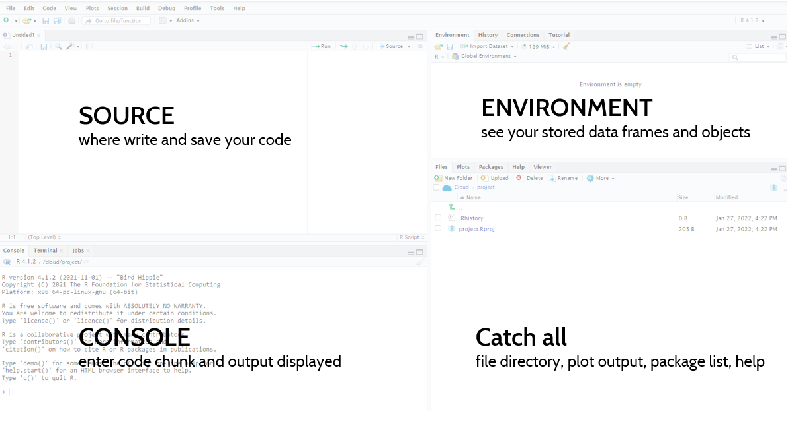

```{r setup, include=FALSE}
knitr::opts_chunk$set(echo = TRUE)
```

### Objectives

For our R Building Blocks session today, we will be kicking everything off and giving a quick run down of R and getting a sense of how plotting with in R with the `ggplot` package.

### Setup

For these sessions, we'll be using RStudio which is an IDE, "Integrated development environment" that makes it easier to work with R. So the first thing you need is to install R, an open-source statistics package. You can do this on your USAID GFE, by going to Start > Microsoft Endpoint manager > Software Center. Once there, you can select the Application called "R for Windows" and click "Install". If working on a personal machine, you can install R from [CRAN](https://cran.r-project.org/). Select "Download R for Windows" and then "base" and follow the instructions for installing that pop up when you launch the .exe file from your downloads.

R is the underlying software we're using, but the user interface leaves much to be desired. RStudio used to be available in Software Center as well, but M/CIO removed around October 2021. In order to install RStudio, you will need to submit a ticket the M/CIO Help Desk ticket to have them install both RStudio and [Rtools](https://cran.r-project.org/bin/windows/Rtools/rtools40.html). If working on a personal machine, you can install RStudio from [this site](https://www.rstudio.com/products/rstudio/download/). Select "Download" for the free version and follow the instructions for installing that pop up when you launch the .exe file from your downloads.

The other option we recommend if you're just getting started or are waiting on M/CIO to install RStudio on your computer is to use [RStudio Cloud](https://cloud.rstudio.com/). You can create a free account and be able to work with our PEPFAR dummy data in that space.


### Exploring RStudio IDE

RStudio may seem imposing at first, but in no time you'll know where everything is. Your RStudio will be broken down into 4 main components.



  - Source: this box won't be here when you first open RStudio. If you go to File > New File > R Script, you will see this box. This is where you can write/save or open your R scripts. 
  - Console: below Source, you will have your console. This is where all your R code are excuted and where the outputs are displayed. If you want to run a line as a one off, you can write it here.
  - Environment - moving to the upper right hand corner, you have your environment tab. This box contains all the datasets or objects you have stored in your current working session. 
  - Catch All - this last box has a lot of different features. You can see a number of tabs, which allow you to expore your directories/files, this is where your graphs will print, and where the help files are located.
  

### Installing package dependencies

With proprietary programs like Excel, Tableau, or Stata, all of your functions are built into the software. With open-source packages on the other hand, we need to load different libraries or packages that are written by other organization or individuals users. To install a package from CRAN, we use the command `install.packages()`. 

Let's install a few packages. To do so, type the following commands one at a time into your Console and hit enter after each. The `tidyverse` will take a minute or two to install.

```{r,  eval = FALSE}
 install.packages("tidyverse")
 install.packages("remotes")
```

We also may need to install packages from other locations, like GitHub, and will use a slightly different command, `remotes::install_github()`. Like above, you will need to type the following command into your console.

```{r, eval = FALSE}
remotes::install_git("USAID-OHA-SI/glitr")
```

### Loading packages 
With the packages installed, we're ready to start working. Open up a new script if you don't have one open (File > New File > R Script or CTRL + SHIFT + N). In there, you will want to addd the following code to load the libraries that we're going to use for this session. To run code from the console, you will hit CTRL + ENTER. This will run the current line your cusor is on. To run multiple lines, you will highlight those lines and then hit CTRL + ENTER.

```{r}
library(tidyverse)
library(glitr)
```

## Viewing the data
The dataset we're using today is stored in the `glitr` package. It's a masked HFR dataset that has information for FY50 on multi-month dispensing, MMD. Let's take a look at the data using `glimpse()` and then `View()`. *If you are getting an error, make sure you reinstall `glitr` using the code in the section about

```{r}
#prints out a previous with your indicators vertically (with type) and data runs horizontally
glimpse(hfr_mmd)
```
```{r, eval = FALSE}
#your traditional tabular view
View(hfr_mmd)
```

Each row is a distinct reporting period (date:hfr_pd) with information on where the data were reported (operatingunit:pnsu), by whom (mech_code) and how much (tx_curr:share_tx_mmd.o3mo). For more information on the dataset, we can use the `?` to see the documentation through a "help" file. This function is extremely useful for getting help files 

```{r, eval = FALSE}
?hfr_mmd
```
### Plotting
Great, we have our data, now we can move onto start plotting. To plot our data, we're going to a package called `ggplot2` which is part of the Tidyverse and installed/loaded with `tidyverse`.

Creating a plot with `ggplot2` is simply about providing some basic information and building layers as you go. We always will start with `ggplot()` to create a coordinate system and then add on a number of mapping arguments or layers. So we are going to pass the dataset into `ggplot()` and we will start by creating a scatter plot using `geom_point()`. In addition to passing in the dataset, we need to provide the function with what we want on the x and y axis.

```{r}
ggplot(data = hfr_mmd) +
  geom_point(mapping = aes(x = date, y = tx_mmd.o3mo))
```

Et voila, we have a plot! Each of those points is a site in a given month associated with the value provided.

### Exercises
- How many rows are in `hfr_mmd`?
- Create a plot to explore the relationship between patient volume (`tx_curr`) and share on over 3 months of treatment dispensing (`share_tx_mmd.3mo`). Looking at the help file and the plot, what makes this plot not very telling?

### Aesethic mapping

We have developed a basic plot with two lines of code. There's a lot of area

