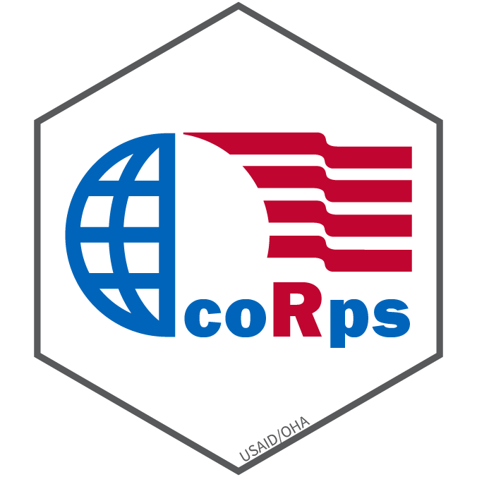

# coRps 

## About
Our mission is to create an inclusive learning/sharing collaborative withing [USAID's Office of HIV/AIDS (OHA)](https://www.usaid.gov/global-health/health-areas/hiv-and-aids) where analysts can gain from others' analytic experiences, primarily in and around R. The focus is on how improving our skills collectively so we can develop and foster principles of conducting analysis and viz that will bleed over to the rest of the office.

## Resources
- [R for Data Science](https://r4ds.had.co.nz/)
- [Markdown Cheatsheet](https://github.com/adam-p/markdown-here/wiki/Markdown-Cheatsheet)

## Session Topics

| date      | topic                            | presenters         |
|-----------|----------------------------------|--------------------|
| 3/11/2020 | kick   off                       |                    |
| 3/16/2020 | no   meeting held, remote work   |                    |
| 3/30/2020 | visualization   I                | Aaron C            |
| 4/13/2020 | visualization   II               | Aaron C            |
| 4/27/2020 | data   transformation I          | Josh D             |
| 5/11/2020 | data transformation II           | Josh D + Baboyma K |
| 5/25/2020 | importing   + merging/appending  | Gina S             |
| 6/8/2020  | working   with strings + factors | Tim E              |
| 6/22/2020 | functions   (basics) + iteration | Aaron C            |
| 7/6/2020  | mapping                          | Baboyma   K        |
| 7/20/2020 | GitHub/project   workflow        |                    |

## Proposed Discussion topics
- basic to exploratory analysis (data viz) in R
- structuring reproducible analysis
- survey data using R
- functions and packages
- Makeover Mondays/Tidy Tuesdays
- mapping in R
- fun with strings
- Rmds and knitting
- the role of GitHub
- "loops"/purrr to automate the boring stuff
- Shiny basics
- API
- designing workshops geared at introducing others to R, tidy data, and other related principles

---

*Disclaimer: The findings, interpretation, and conclusions expressed herein are those of the authors and do not necessarily reflect the views of United States Agency for International Development. All errors remain our own.*
